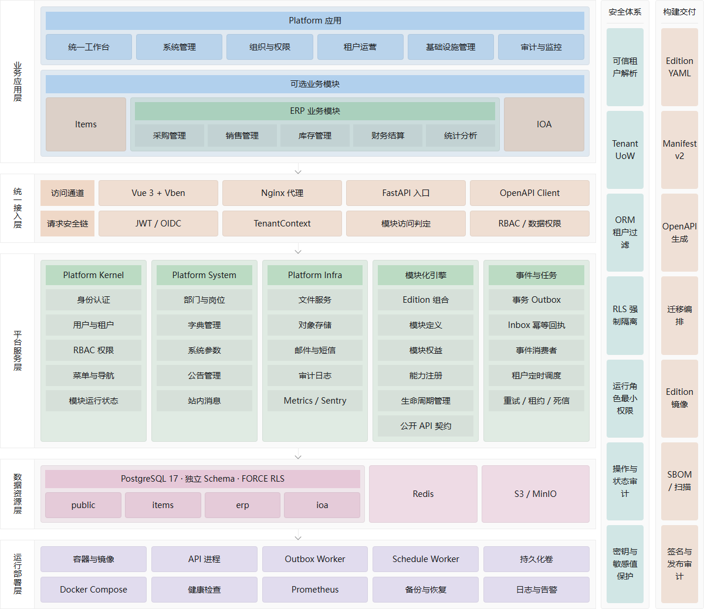

# Fast Vben Admin

[中文](./README.md) | **English**

Fast Vben Admin is a modular full-stack administration platform for back-office and multi-tenant SaaS applications. It follows a modular monolith architecture with build-time Edition composition: FastAPI provides the API, transaction, and security boundaries; the Vue Vben Admin `web-antd` application provides the management UI; Platform supplies authentication, tenancy, RBAC, system administration, and infrastructure capabilities; and business modules such as Items and ERP are delivered through a shared module contract selected by each Edition.

## Development Notes

- `frontend/apps/web-antd` is the supported frontend application. Other Vben UI applications remain in the repository but are outside this project's maintained feature scope.
- Automated coding agents and contributors must read the repository-level [Agent Development Standard](./AGENTS.md) before making changes, followed by the nearest `AGENTS.md` for the target directory.
- Backend OpenAPI Schema is the source of truth for frontend API types. Run `pnpm generate:api` after API changes; do not hand-edit files in `src/api/generated`.
- `editions/<edition>.yaml` is the sole source of truth for an Edition's module set. Build Manifests, frontend module registration, and image composition are generated by repository commands.
- The default Docker Compose override is for local hot reload, with the frontend at `http://localhost:5174`. The production Compose combination serves it at `http://localhost:5173`.

## Overview

The project uses a frontend/backend-separated modular monolith. Backend APIs are mounted under `/api/v1`; the frontend assembles pages, navigation, and button access from the Build Manifest, backend-provided menus, and permission codes. Platform is mandatory in every Edition, while each business module owns its backend implementation, frontend pages, database schema, migration namespace, and public contracts.

## Architecture



The architecture combines horizontal business and technical layers with vertical security and build-delivery controls:

- **Application layer**: Platform applications sit alongside optional business modules such as Items and ERP. Procurement, sales, inventory, finance, and statistics are internal ERP domains rather than separate top-level modules.
- **Unified access layer**: Vue, Nginx, FastAPI, and generated OpenAPI clients form the access path. Requests pass through authentication, trusted tenant resolution, module access checks, and RBAC/data-scope enforcement.
- **Platform services**: Platform is internally divided into the Kernel, System, and Infra bounded contexts. The module engine governs Editions, module contracts, entitlements, capabilities, and lifecycle state.
- **Events and tasks**: Cross-module state changes use a transactional Outbox. Consumers use Inbox receipts for idempotency and share retry, lease, dead-letter, and per-tenant scheduling mechanisms.
- **Data and security**: Platform and business modules have explicit table ownership. Tenant UoW, automatic ORM filtering, PostgreSQL RLS, and a restricted runtime role form the tenant-isolation boundary.
- **Build and delivery**: Edition YAML drives the Build Manifest, migration plan, OpenAPI clients, and frontend/backend images, with scanning, SBOM generation, signing, and release auditing in the delivery pipeline.

IOA in the diagram represents an extension module that follows the target module contract. The modules and compositions actually available in this repository are always defined by the YAML files under [`editions/`](./editions). See the [Modular Architecture Implementation Baseline](./docs/modular-architecture-implementation.md) for detailed boundaries, current implementation status, and acceptance criteria.

## Included Capabilities

### Platform Core and System

| Module | Description |
| --- | --- |
| Authentication and account security | JWT login, password recovery and reset, login rate limits and CAPTCHA, QR-code login, TOTP MFA with recovery codes, and profile/password management. |
| Enterprise identity | Configurable enterprise OIDC SSO, account mapping, role mapping, and active-status synchronization. |
| RBAC | Users, roles, menus, permission codes, backend authorization checks, and backend-driven menus. |
| Organization | Departments, posts, user-post assignments, and all/department/department-and-children/self/custom data scopes. |
| Multi-tenancy | Shared-schema isolation, memberships, tenant switching with old-session revocation, plans, quotas, and initialization templates. |
| Module governance | Edition assembly, module runtime state, plan entitlements, contract overrides, tenant enablement preferences, and module-access caching. |
| Audit and messages | Login logs, operation logs, notice publishing, personal messages, and read-state tracking. |

### Platform Infra and Development Support

| Module | Description |
| --- | --- |
| Settings and dictionaries | Tenant-scoped system settings, public settings, dictionary types, and dictionary items. |
| File service | File management, avatar upload, size/type limits, local and S3/MinIO-compatible storage, and private pre-signed download URLs. |
| Communication | Management pages for mail and SMS channels, templates, and delivery logs. |
| Code generation | Database-table-driven ZIP starter modules with FastAPI schemas, CRUD route skeletons, Vben API wrappers, and list pages. |
| OpenAPI contract | Export the current backend schema and generate frontend TypeScript types and client code. |
| Events and tasks | Transactional Outbox, idempotent Inbox receipts, consumer retry and dead letters, an Outbox Worker, and per-tenant Schedule Workers. |
| Observability | Health checks, Prometheus metrics, Sentry integration points, and backend/frontend/Compose CI workflows. |

### Business Modules

| Module | Role | Main capabilities |
| --- | --- | --- |
| `items` | Reference business module | CRUD, import/export, CSV templates, an independent schema and migration namespace, and tenant isolation. |
| `erp` | Enterprise resource management | Products and business partners, procurement, sales, inventory, transfers and stocktaking, financial settlement, reconciliation, attachments, auditing, and analytics. |

Business modules may depend only on stable Platform interfaces and the `public_api` of declared module dependencies. Optional collaboration uses Capability contracts to select providers instead of importing another optional module's implementation.

## Technology Stack

| Technology | Purpose |
| --- | --- |
| Python 3.14, FastAPI, SQLModel, Alembic | Backend services, data models, and database migrations |
| PostgreSQL 17, Redis 8 | Business data, caching, login rate limits, and temporary state |
| Vue 3, Vite, TypeScript, Pinia, Vue Router | Frontend application, state, and routing |
| Vue Vben Admin, Ant Design Vue | The `web-antd` management UI |
| Edition YAML, Build Manifest | Build-time module composition, version digests, migrations, and frontend/backend artifact consistency |
| Tenant UoW, PostgreSQL RLS | Multi-tenant data isolation shared by APIs, Workers, and Schedules |
| Outbox, Inbox, Capability | Cross-module events, idempotent consumption, and optional capability decoupling |
| pnpm 11, uv | Frontend and backend dependency tooling |
| Docker Compose, Nginx, Mailpit, Adminer, MinIO | Containerized runtime, mail preview, database administration, and object storage |

## Screenshots

The following screenshots were captured from the default tenant in the local Compose environment.

### Overview

| Sign in | Dashboard |
| --- | --- |
|  |  |

| User management | Dictionary management |
| --- | --- |
|  |  |

### Tenancy and Access Control

| Tenant management | Role management |
| --- | --- |
|  |  |

| Menu management | File management |
| --- | --- |
|  |  |

### Message Center

| Notice management |
| --- |
|  |

## Getting Started

### Requirements

- Docker Desktop / Docker CLI for the recommended complete local environment
- Python 3.14 and [uv](https://docs.astral.sh/uv/) for standalone backend development
- Node.js 22.18+ and pnpm 11.7+ for standalone frontend development

### Local Docker Compose Development

```powershell
Copy-Item .env.example .env
docker compose up --build
```

| Service | URL |
| --- | --- |
| Frontend development server | http://localhost:5174 |
| Backend API | http://localhost:8000/api/v1 |
| API documentation | http://localhost:8000/docs |
| OpenAPI Schema | http://localhost:8000/api/v1/openapi.json |
| Mail preview | http://localhost:1080 |
| Adminer | http://localhost:8080 |

Default local administrator:

```text
Tenant code: default
Email: admin@example.com
Password: changethis
```

Use the default credentials only locally. Before any non-local deployment, change `SECRET_KEY`, `FIRST_SUPERUSER_PASSWORD`, `POSTGRES_PASSWORD`, the CORS allow list, and storage credentials.

To start MinIO, enable the storage profile:

```powershell
docker compose --profile storage up --build
```

MinIO API: `http://localhost:9000`; console: `http://localhost:9001`.

### Standalone Development

On Windows, the setup helper creates `.env` and installs backend and frontend dependencies:

```powershell
pnpm setup
```

When using a local PostgreSQL server for the backend, override the Docker-only hostname first:

```powershell
$env:POSTGRES_SERVER = 'localhost'
cd backend
uv sync
uv run alembic upgrade head
uv run python app/initial_data.py
uv run fastapi dev app/main.py
```

Start the frontend independently:

```powershell
cd frontend
pnpm install
pnpm -F @vben/web-antd run dev
```

### Common Commands

```powershell
pnpm backend:lint
pnpm backend:test
pnpm frontend:typecheck
pnpm frontend:build
pnpm frontend:e2e
pnpm generate:api -- --edition erp
pnpm build:edition -- --edition erp
pnpm migrate:edition -- --edition erp
pnpm reconcile:modules -- --edition erp
```

`pnpm generate:api -- --edition <edition>` exports a temporary OpenAPI Schema from the selected backend composition and generates separate Platform and business-module clients; it does not require a running service on `localhost:8000`. Edition generation, build, migration, and runtime reconciliation must use the same module composition.

## Deployment

For production, use the base Compose file with the production override. The frontend is served at `http://localhost:5173`:

```powershell
Copy-Item .env.example .env
docker compose -f compose.yml -f compose.production.yml up -d --build
```

See [deployment](./docs/deployment.md) for production variables, migrations, persistent storage, and S3/MinIO configuration.

## Documentation

- [Agent development standard](./AGENTS.md)
- [Modular product architecture](./docs/modular-product-architecture.md)
- [Modular architecture implementation baseline](./docs/modular-architecture-implementation.md)
- [Architecture decision records](./docs/adr/README.md)
- [Local development](./docs/development.md)
- [Deployment](./docs/deployment.md)
- [API contract](./docs/api-contract.md)
- [RBAC](./docs/rbac.md)
- [Module development guide](./docs/module-guide.md)
- [Enterprise OIDC configuration](./docs/enterprise-oidc.md)
- [Monitoring](./docs/monitoring.md)
- [FAQ](./docs/faq.md)

## Support the Project

If this project has been helpful to you, consider buying me a coffee. Your support helps keep the project maintained and improving. Thank you for every contribution.

<p align="center">
  
</p>

## Acknowledgements

This project builds on ideas and architecture from [Full Stack FastAPI Template](https://github.com/fastapi/full-stack-fastapi-template) and [Vue Vben Admin](https://github.com/vbenjs/vue-vben-admin).
