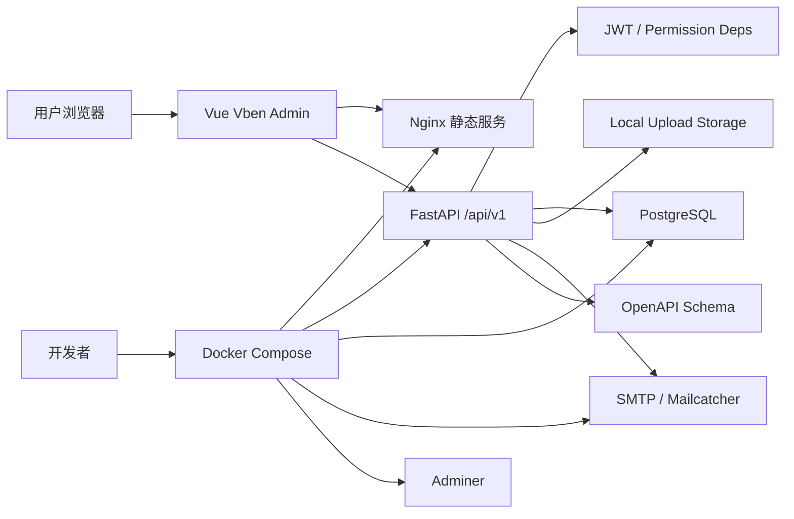
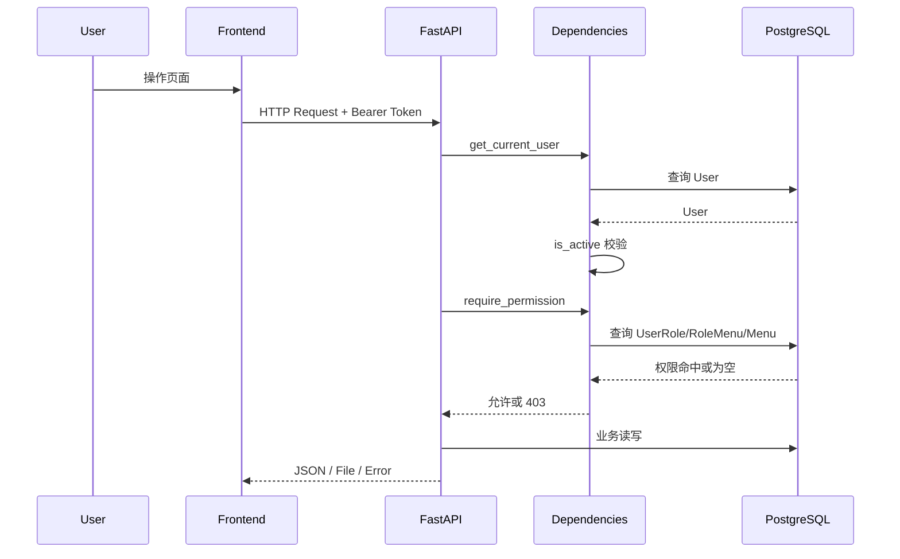
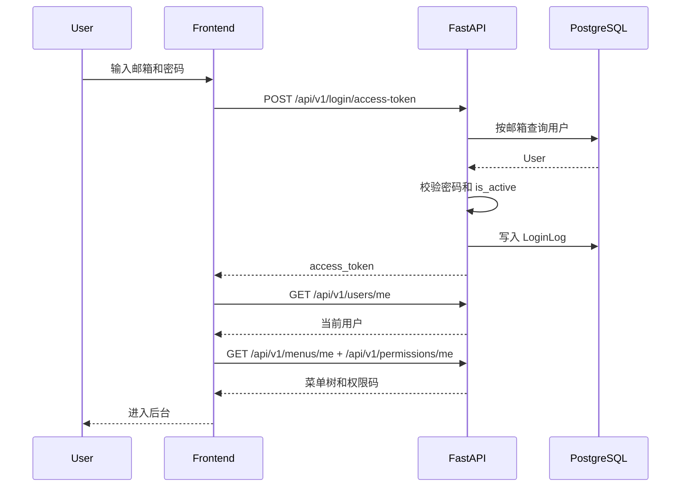

# Fast Vben Admin 技术需求文档 TRD

## 1. 文档信息

| 项目 | 内容 |
| --- | --- |
| 文档名称 | Fast Vben Admin 技术需求文档 |
| 文档类型 | TRD, Technical Requirements Document |
| 关联文档 | [PRD](./PRD.md), [DEVELOPMENT_PLAN](./DEVELOPMENT_PLAN.md), [RBAC](./rbac.md), [API 契约](./api-contract.md) |
| 参考项目 | `参考项目/LZ-litchi`、`参考项目/LZ-litchi-ui-admin-vben`、当前仓库实现 |
| 项目阶段 | v1.0 技术收口 |
| 目标版本 | v1.0.0 |
| 更新日期 | 2026-07-09 |
| 目标读者 | 后端开发、前端开发、测试、运维、项目维护者 |

## 2. 文档目标

本文档把 PRD 中的产品目标转化为可实现、可测试、可维护、可部署的技术要求。它用于约束 v1.0 版本的系统架构、模块边界、数据模型、API 契约、权限模型、初始化策略、前端接入、测试标准和部署要求。

本文档回答以下问题：

- 当前 FastAPI + Vben 后台基座如何分层。
- v1.0 需要稳定哪些后端模型、路由和权限码。
- 前端如何消费 OpenAPI、动态菜单、权限码和业务接口。
- 初始化数据如何做到可重复、可演进、可验证。
- 登录、RBAC、菜单、部门、字典、参数、日志、文件、通知、Items 如何闭环。
- 如何为 Litchi 中的岗位、在线用户、代码生成、对象存储、定时任务、国际化、OAuth2、多租户等后续能力预留扩展点。

## 3. 技术定位

Fast Vben Admin v1.0 是一个 Python 技术栈的中后台系统基座。技术定位不是“最小 demo”，而是“可二次开发、可部署、可审计、可扩展的后台基础平台”。

v1.0 技术重点：

- 后端以 FastAPI、SQLModel、Pydantic、Alembic、PostgreSQL 为核心。
- 前端以 Vue 3、Vite、TypeScript、Vben Admin、Ant Design Vue 为核心。
- 认证使用邮箱密码 + JWT access token。
- 权限使用 RBAC，`User.is_superuser` 作为超级管理员快速通道和兼容字段。
- OpenAPI 是前后端类型契约来源。
- Docker Compose 是统一本地和最小生产部署路径。
- v1.0 优先保证通用后台基建质量，不引入复杂多租户、BPM、CRM/ERP/AI 业务套件。

## 4. 技术目标与非目标

### 4.1 v1.0 技术目标

- 完成登录认证、用户、角色、菜单、部门、字典、参数、日志、文件、通知、站内消息、仪表盘、Items 示例模块的技术闭环。
- 所有管理接口通过后端权限依赖校验，前端菜单和按钮显隐只做体验优化。
- 默认数据包含超级管理员、默认部门、内置角色、菜单、按钮权限、字典、系统参数。
- OpenAPI schema 可生成前端类型，前端手写 API wrapper 与生成类型保持一致。
- 后端列表接口统一分页响应：`items/total/page/page_size`。
- 错误响应和 HTTP 状态码稳定，避免前端逐接口特判。
- 文件上传支持大小限制、扩展名白名单、hash 记录、本地存储和未来对象存储扩展点。
- 登录日志和操作日志覆盖关键安全、审计和排错场景。
- 后端核心测试、前端构建、关键 E2E、Docker Compose 最小部署可验证。

### 4.2 v1.0 非目标

- 不实现 SaaS 多租户隔离、租户套餐和租户菜单订阅。
- 不实现 OAuth2/OIDC/SSO、第三方登录和应用授权管理。
- 不实现 BPM 工作流、表单设计器、流程设计器。
- 不实现 CRM、ERP、AI 等垂直业务模块。
- 不实现多数据库官方适配，默认只保证 PostgreSQL。
- 不实现 Kubernetes Helm Chart。
- 不实现完整低代码代码生成平台，但保留 v1.2 代码生成扩展方向。

## 5. 总体架构

### 5.1 架构概览



### 5.2 运行时组件

| 组件 | 技术 | 职责 |
| --- | --- | --- |
| Web Frontend | Vue 3, Vite, TypeScript, Vben, Ant Design Vue | 管理后台 UI、路由、菜单、权限按钮、请求封装 |
| Backend API | FastAPI, SQLModel, Pydantic | API、认证、权限、业务逻辑、数据访问 |
| Database | PostgreSQL | 持久化用户、权限、系统配置、业务数据、日志 |
| Migration | Alembic | schema 版本管理 |
| Storage | Local FS, future S3/MinIO | 文件上传、下载、删除 |
| Mail | SMTP / Mailcatcher | 重置密码、测试邮件 |
| Static Server | Nginx | 生产环境前端静态资源服务 |
| Adminer | Adminer | 本地数据库管理 |
| CI | GitHub Actions | 测试、构建、质量检查 |

### 5.3 请求链路



### 5.4 登录链路



## 6. 仓库结构要求

### 6.1 当前目标结构

```text
fastapi-vue-vben-admin/
  backend/
    app/
      api/
        deps.py
        main.py
        routes/
          login.py
          users.py
          roles.py
          menus.py
          departments.py
          dictionaries.py
          settings.py
          logs.py
          files.py
          notices.py
          permissions.py
          dashboard.py
          items.py
          utils.py
      core/
        config.py
        db.py
        security.py
      alembic/
      email-templates/
      audit.py
      crud.py
      initial_data.py
      main.py
      models.py
      storage.py
      utils.py
    tests/
    pyproject.toml
  frontend/
    apps/
      web-antd/
        src/
          api/
            core/
            generated/
          router/
          views/
          locales/
    packages/
    package.json
  docs/
    PRD.md
    TRD.md
    DEVELOPMENT_PLAN.md
    api-contract.md
    rbac.md
  scripts/
  compose.yml
  compose.override.yml
  .env.example
  README.md
```

### 6.2 结构约束

- 后端业务路由放入 `backend/app/api/routes`。
- 后端共享依赖放入 `backend/app/api/deps.py`。
- 后端表模型和 API Schema 当前集中在 `backend/app/models.py`，v1.x 可按模块拆分。
- 后端初始化数据入口为 `backend/app/initial_data.py`，实际种子逻辑位于 `backend/app/core/db.py`。
- 前端默认应用为 `frontend/apps/web-antd`。
- 前端业务页面放入 `frontend/apps/web-antd/src/views`。
- 前端手写 API wrapper 放入 `frontend/apps/web-antd/src/api/core`。
- 前端 OpenAPI 生成代码放入 `frontend/apps/web-antd/src/api/generated`，不得手改生成文件。
- 文档放入 `docs`，实现变化必须同步更新相关文档。

## 7. 后端技术要求

### 7.1 FastAPI 应用要求

- API 统一挂载在 `/api/v1`。
- 路由聚合入口为 `backend/app/api/main.py`。
- 生产环境是否开放 `/docs`、`/redoc` 应可由配置控制。
- 所有路由必须声明响应模型或明确返回类型。
- 管理接口必须依赖 `require_permission("<permission_code>")`。
- 当前用户接口必须依赖 `CurrentUser`。
- 列表接口必须分页，默认 `page=1`、`page_size=20`。
- 删除接口成功时可返回 `Message` 或 `204`，同一模块内保持一致。
- 业务异常必须使用明确 HTTP 状态码：`400`、`401`、`403`、`404`、`409`、`422`。

### 7.2 配置要求

核心配置来自 `backend/app/core/config.py` 和根目录 `.env`。

必须支持：

| 配置 | 说明 |
| --- | --- |
| `API_V1_STR` | API 前缀，默认 `/api/v1` |
| `PROJECT_NAME` | 项目名称 |
| `ENVIRONMENT` | `local/staging/production` |
| `SECRET_KEY` | JWT 签名密钥 |
| `ACCESS_TOKEN_EXPIRE_MINUTES` | access token 有效期 |
| `FRONTEND_HOST` | 前端地址 |
| `BACKEND_CORS_ORIGINS` | CORS 白名单 |
| `POSTGRES_*` | PostgreSQL 连接配置 |
| `FIRST_SUPERUSER` | 首个超级管理员邮箱 |
| `FIRST_SUPERUSER_PASSWORD` | 首个超级管理员密码 |
| `SMTP_*` | 邮件配置 |
| `UPLOAD_DIR` | 本地上传根目录 |
| `UPLOAD_MAX_SIZE_MB` | 上传大小限制 |
| `UPLOAD_ALLOWED_EXTENSIONS` | 上传扩展名白名单 |

安全要求：

- `SECRET_KEY`、`POSTGRES_PASSWORD`、`FIRST_SUPERUSER_PASSWORD` 在非 local 环境不能为 `changethis`。
- `.env` 不得提交。
- `.env.example` 必须覆盖 v1.0 启动所需全部配置。

### 7.3 数据库与迁移

- 默认数据库为 PostgreSQL。
- ORM 使用 SQLModel。
- 迁移使用 Alembic，迁移文件位于 `backend/app/alembic/versions`。
- 新增或修改表结构必须提供 Alembic migration。
- 初始化数据不应替代 schema migration。
- UUID 作为主要业务表主键。
- 时间字段统一使用带时区的 `DateTime(timezone=True)`。
- 业务列表常用筛选字段应建立索引。

### 7.4 后端分层

| 层 | 文件/目录 | 职责 |
| --- | --- | --- |
| App Entry | `app/main.py` | 创建 FastAPI 实例，注册中间件、路由、异常处理 |
| Router | `app/api/routes/*.py` | HTTP 路由、请求响应模型、权限依赖 |
| Dependencies | `app/api/deps.py` | DB Session、Token、当前用户、权限校验 |
| Core Config | `app/core/config.py` | 环境变量和安全校验 |
| Core DB | `app/core/db.py` | engine、初始化种子 |
| Core Security | `app/core/security.py` | 密码 hash、JWT |
| Models | `app/models.py` | SQLModel 表模型、Pydantic schema |
| CRUD | `app/crud.py` | 通用数据访问和用户/业务持久化 |
| Audit | `app/audit.py` | 登录日志、操作日志中间件 |
| Storage | `app/storage.py` | 文件校验、存储、删除 |
| Utils | `app/utils.py` | 邮件、token、辅助函数 |
| Tests | `backend/tests` | API、CRUD、脚本、权限测试 |

v1.0 允许模型集中在 `models.py`。当单文件超过可维护阈值时，v1.x 可拆为：

```text
app/models/
  auth.py
  rbac.py
  system.py
  audit.py
  file.py
  notice.py
  item.py
```

## 8. 数据模型要求

### 8.1 核心模型

| 模型 | 表 | 说明 |
| --- | --- | --- |
| `User` | `user` | 系统用户 |
| `Role` | `role` | 角色 |
| `Menu` | `menu` | 目录、菜单、按钮、权限码载体 |
| `Department` | `department` | 部门组织 |
| `UserRole` | `userrole` | 用户角色关联 |
| `RoleMenu` | `rolemenu` | 角色菜单/权限关联 |
| `DictionaryType` | `dictionarytype` | 字典类型 |
| `DictionaryItem` | `dictionaryitem` | 字典项 |
| `SystemSetting` | `systemsetting` | 系统参数 |
| `LoginLog` | `loginlog` | 登录日志 |
| `OperationLog` | `operationlog` | 操作日志 |
| `FileAsset` | `fileasset` | 文件资产 |
| `Notice` | `notice` | 通知公告 |
| `UserMessage` | `usermessage` | 用户站内消息 |
| `Item` | `item` | 示例业务资源 |

### 8.2 用户模型

`User` 必须包含：

- `id`
- `email`
- `hashed_password`
- `is_active`
- `is_superuser`
- `full_name`
- `department_id`
- `avatar_url`
- `created_at`
- `updated_at`

约束：

- `email` 唯一。
- 禁用用户不能登录。
- `is_superuser=True` 用户绕过普通权限码校验。
- 删除用户时必须处理 `items`、`userrole`、`usermessage` 等关联关系。

### 8.3 RBAC 模型

`Role` 字段：

- `code`
- `name`
- `description`
- `sort`
- `is_active`
- `is_system`
- `created_at`
- `updated_at`

`Menu` 字段：

- `title`
- `type`: `directory/menu/button`
- `parent_id`
- `route_path`
- `route_name`
- `component`
- `icon`
- `permission_code`
- `sort`
- `is_visible`
- `is_keep_alive`
- `is_active`
- `created_at`
- `updated_at`

约束：

- `Role.code` 唯一。
- `Menu.permission_code` 建议唯一，空值只允许目录类菜单。
- `UserRole`、`RoleMenu` 使用复合主键，并启用级联删除。
- `is_system=True` 的内置角色和关键菜单需要保护。
- 菜单树不得形成循环父子关系。

### 8.4 系统配置模型

`DictionaryType.code` 唯一。`DictionaryItem` 通过 `type_id` 归属字典类型。

`SystemSetting.key` 唯一，`value_type` 支持：

- `string`
- `number`
- `boolean`
- `json`

要求：

- `is_public=True` 的参数可通过公开接口读取。
- `is_system=True` 的参数不能被普通删除，更新需保留 key。
- JSON 类型参数必须在后端校验 JSON 格式。

### 8.5 审计模型

`LoginLog` 记录：

- `user_id`
- `email`
- `ip`
- `user_agent`
- `status`
- `failure_reason`
- `created_at`

`OperationLog` 记录：

- `user_id`
- `email`
- `module`
- `action`
- `method`
- `path`
- `status_code`
- `duration_ms`
- `ip`
- `user_agent`
- `request_summary`
- `response_summary`
- `created_at`

要求：

- 密码、token、验证码、密钥不得明文入库。
- 默认不记录 GET/HEAD/OPTIONS 操作日志。
- 登录、找回密码、重置密码等敏感路径不记录操作日志正文。
- 日志表 v1.x 需要补充保留策略和归档策略。

### 8.6 文件模型

`FileAsset` 记录：

- `original_name`
- `stored_name`
- `content_type`
- `extension`
- `size`
- `sha256`
- `storage_provider`
- `storage_path`
- `public_url`
- `uploader_id`
- `is_public`
- `created_at`

要求：

- v1.0 默认 `storage_provider=local`。
- 文件真实路径必须限制在 `UPLOAD_DIR` 内，禁止路径穿越。
- 文件上传必须校验扩展名和大小。
- 删除文件时同步处理数据库记录和本地文件。
- 私有文件下载必须校验登录和权限。

## 9. API 设计要求

### 9.1 通用契约

- API 前缀统一为 `/api/v1`。
- 请求和响应均使用 JSON，文件上传使用 `multipart/form-data`。
- 时间字段使用 ISO 8601。
- ID 使用 UUID 字符串传输。
- 列表响应统一：

```json
{
  "items": [],
  "total": 0,
  "page": 1,
  "page_size": 20
}
```

- 错误响应目标格式：

```json
{
  "code": "VALIDATION_ERROR",
  "message": "Request validation failed",
  "details": {}
}
```

当前实现中部分 FastAPI 默认错误仍可能使用 `detail`，v1.0 发布前需要统一或在 `docs/api-contract.md` 中明确兼容策略。

### 9.2 路由清单

| 模块 | 路径 | 说明 |
| --- | --- | --- |
| 登录 | `/login/*` | 登录、测试 token、找回密码、重置密码 |
| 用户 | `/users` | 当前用户、用户管理、用户角色 |
| 角色 | `/roles` | 角色 CRUD、角色菜单 |
| 菜单 | `/menus` | 菜单 CRUD、当前用户菜单、权限码 |
| 权限 | `/permissions/me` | 当前用户权限码 |
| 部门 | `/departments` | 部门 CRUD |
| 字典 | `/dictionary-types`、`/dictionary-items` | 字典类型和字典项 |
| 参数 | `/settings` | 系统参数和公开参数 |
| 日志 | `/logs/login`、`/logs/operation` | 登录日志和操作日志 |
| 文件 | `/files` | 文件列表、上传、下载、删除、头像 |
| 通知 | `/notices`、`/messages/me` | 通知公告和站内消息 |
| 仪表盘 | `/dashboard` | 统计和概览 |
| Items | `/items` | 示例业务 CRUD、导入导出 |
| 工具 | `/utils` | 邮件测试、健康检查 |

### 9.3 权限码规范

权限码采用 `<domain>:<resource>:<action>`。

v1.0 必须内置：

```text
dashboard:view
system:user:list
system:user:create
system:user:update
system:user:delete
system:role:list
system:role:create
system:role:update
system:role:delete
system:menu:list
system:menu:create
system:menu:update
system:menu:delete
system:department:list
system:department:create
system:department:update
system:department:delete
system:dict:list
system:dict:create
system:dict:update
system:dict:delete
system:setting:list
system:setting:update
system:login-log:list
system:operation-log:list
system:file:list
system:file:upload
system:file:delete
system:notice:list
system:notice:create
system:notice:update
system:notice:delete
personal:message:list
business:item:list
business:item:create
business:item:update
business:item:delete
```

### 9.4 分页、排序和筛选

列表接口要求：

- 支持 `page`、`page_size`。
- `page` 从 1 开始。
- `page_size` 应有最大值限制，建议最大 100。
- 常见筛选字段按模块定义，例如 keyword、status、created_from、created_to。
- 排序字段必须白名单化，禁止直接拼接 SQL。

### 9.5 导入导出

v1.0 Items 模块提供导入导出范例。

要求：

- 导出接口返回 CSV 或 XLSX 文件。
- 导入接口必须返回总数、成功数、失败数、失败原因。
- 导入不得绕过权限。
- 导入失败不应产生半成品脏数据，必要时使用事务。

## 10. 权限与认证技术要求

### 10.1 JWT

- 登录成功返回 access token。
- token 载荷必须包含用户 ID。
- 后端通过 `OAuth2PasswordBearer` 从 `Authorization: Bearer <token>` 读取 token。
- token 解码失败返回 403 或 401，前端统一引导重新登录。
- v1.0 不实现 refresh token。

### 10.2 当前用户依赖

`get_current_user` 必须完成：

- 解码 JWT。
- 校验 token payload。
- 查询用户。
- 校验用户存在。
- 校验 `is_active=True`。

### 10.3 权限依赖

`require_permission(permission_code)` 必须完成：

- 超级管理员直接通过。
- 普通用户通过 `UserRole -> RoleMenu -> Menu` 查询权限。
- 只允许命中 `Menu.is_active=True` 的权限。
- 只允许命中 `Role.is_active=True` 的角色授权。
- 无权限返回 403。

后续优化：

- v1.1 可加入权限缓存。
- v1.2 可加入数据权限。

### 10.4 前端权限

前端必须：

- 登录后请求当前用户。
- 请求 `/menus/me` 获取菜单。
- 请求 `/permissions/me` 或 `/menus/permissions/me` 获取权限码。
- 根据菜单生成导航。
- 根据权限码控制按钮显示。
- 处理 401/403：401 重新登录，403 显示无权限页或提示。

前端不得把隐藏按钮当作安全边界。

## 11. 初始化数据技术要求

### 11.1 初始化入口

初始化入口：

- `backend/app/initial_data.py`
- `backend/app/core/db.py:init_db`
- `backend/app/core/db.py:seed_system_data`

初始化必须可重复执行，不得重复插入同一 code/key/permission。

### 11.2 默认数据

必须初始化：

| 类型 | 默认值 |
| --- | --- |
| 超级管理员 | `FIRST_SUPERUSER` |
| 部门 | `headquarters` / 总部 |
| 角色 | `super_admin`、`admin`、`user` |
| 菜单 | dashboard、system、logs、files、notices、messages、items |
| 按钮权限 | 用户、角色、菜单、部门、字典、参数、文件、公告、Items 的 create/update/delete |
| 字典 | `user_status`、`yes_no`、`business_status` |
| 参数 | `system.name`、`system.default_page_size`、`auth.allow_register`、`upload.max_size_mb` |

### 11.3 内置角色授权

| 角色 | 权限策略 |
| --- | --- |
| `super_admin` | 绑定全部菜单和按钮权限，且用户 `is_superuser=True` 仍绕过权限 |
| `admin` | 绑定系统管理、日志、文件、公告、仪表盘、消息等后台管理权限 |
| `user` | 绑定仪表盘、消息和 Items 示例业务权限 |

### 11.4 初始化验收

- 空数据库执行初始化后，默认管理员可登录。
- 默认管理员具备全部菜单。
- 重复执行初始化不会产生重复角色、菜单、字典、参数。
- 默认菜单的 `route_path`、`route_name`、`component` 与前端路由可匹配。
- 默认权限码与后端 `require_permission` 使用的权限码一致。

## 12. 前端技术要求

### 12.1 应用范围

v1.0 默认维护 `frontend/apps/web-antd`。

不要求同步维护：

- `web-naive`
- `web-ele`
- `web-tdesign`
- `web-antdv-next`

### 12.2 前端模块结构

```text
frontend/apps/web-antd/src/
  api/
    core/
      auth.ts
      users.ts
      rbac.ts
      menu.ts
      system-config.ts
      logs.ts
      files.ts
      notices.ts
      dashboard.ts
      items.ts
    generated/
  router/
    routes/
      modules/
        dashboard.ts
        system.ts
        logs.ts
        files.ts
        notices.ts
        items.ts
        account.ts
  views/
    dashboard/
    system/
    logs/
    files/
    notices/
    messages/
    items/
    _core/
```

### 12.3 API 接入

- 生成代码放入 `src/api/generated`。
- 手写封装放入 `src/api/core`。
- 手写封装必须复用统一 request 实例。
- 认证 token 注入、401/403、错误提示应在 request 层集中处理。
- 文件下载使用专门 download helper，避免 JSON 拦截器破坏 Blob。

### 12.4 路由与菜单

- 本地保留核心兜底路由，例如登录、403、404、500、个人中心。
- 系统业务菜单优先来自后端 `/menus/me`。
- 后端返回的 `component` 必须映射到前端实际页面。
- 菜单 `title` 可使用 i18n key，例如 `menu.systemUsers`。
- `authority` 使用权限码数组。
- 无权限路由不可出现在左侧菜单。

### 12.5 页面规范

新增页面必须沿用 Vben 风格：

- 列表页包含查询区、工具栏、表格、分页、操作列。
- 新增/编辑优先使用 Modal 或 Drawer。
- 删除必须有确认。
- 危险操作使用 danger 样式。
- 状态使用 Tag、Switch 或 Badge。
- 图标使用项目已有图标体系。
- loading、empty、error、message、notification 使用统一组件和模式。
- 不保留参考项目无关 Mock 数据。

### 12.6 国际化

v1.0 前端保留静态 i18n 文件。菜单标题可以使用 i18n key。

v1.3 再考虑参考 Litchi 的在线国际化：

- locale 管理。
- i18n key 管理。
- message 管理。
- 导入导出翻译。

## 13. 模块技术设计

### 13.1 认证模块

后端：

- `POST /login/access-token`
- `POST /login/test-token`
- `POST /password-recovery/{email}`
- `POST /reset-password`
- `GET /users/me`
- `PATCH /users/me`
- `PATCH /users/me/password`

要求：

- 登录成功写入成功登录日志。
- 登录失败写入失败登录日志。
- 重置密码 token 使用独立过期时间。
- 密码更新后使用新 hash 覆盖旧 hash。

前端：

- 登录页接真实 API。
- 忘记密码、重置密码接真实 API。
- 登录成功后加载用户、菜单、权限。

### 13.2 用户模块

后端：

- 用户列表、新增、详情、更新、删除。
- 用户角色查询和更新。
- 用户部门字段维护。
- 超级管理员保护。

要求：

- `system:user:list/create/update/delete` 控制管理能力。
- 用户不能删除自己或最后一个超级管理员。
- 邮箱唯一冲突返回 409 或 400，并有稳定错误消息。

前端：

- 用户列表支持搜索、分页、状态、部门筛选。
- 表单支持部门选择、角色分配、启用状态。
- 重置密码单独确认。

### 13.3 RBAC 和菜单模块

后端：

- 角色 CRUD。
- 角色菜单查询和保存。
- 菜单 CRUD。
- 当前用户菜单。
- 当前用户权限码。

要求：

- 角色保存菜单时使用事务。
- 删除角色前检查用户绑定或明确级联策略。
- 删除菜单前检查子菜单或明确级联策略。
- 按钮权限 `is_visible=False`。

前端：

- 角色列表提供权限分配入口。
- 权限分配使用菜单树和按钮权限树。
- 菜单管理支持目录/菜单/按钮类型切换。

### 13.4 部门模块

后端：

- 部门列表/树、新增、编辑、删除。

要求：

- 部门 code 唯一。
- 不允许设置自己或后代为父部门。
- 有用户或子部门时删除必须阻止或明确级联策略。

前端：

- 部门树或表格树展示。
- 用户页面可按部门筛选。

### 13.5 字典模块

后端：

- 字典类型 CRUD。
- 字典项 CRUD。
- 按字典类型 code 查询可用字典项。

要求：

- 字典类型 code 唯一。
- 同一字典类型下 item value 唯一。
- 禁用字典项默认不出现在业务选择项。

前端：

- 字典类型与字典项联动管理。
- 字典项颜色用于表格状态展示。

### 13.6 系统参数模块

后端：

- 参数列表。
- 公开参数列表。
- 参数更新。

要求：

- `system:setting:list` 控制列表。
- `system:setting:update` 控制更新。
- 公开接口只返回 `is_public=True`。
- JSON 类型值必须校验。

前端：

- 按分组展示参数。
- 根据 `value_type` 渲染不同编辑控件。

### 13.7 日志模块

后端：

- 登录日志列表。
- 操作日志列表。
- 操作日志中间件。

要求：

- 默认只记录非 GET 修改类请求。
- 不记录日志查询接口本身。
- 敏感路径不记录请求/响应摘要。
- v1.0 至少支持按账号、状态、时间、模块筛选。

前端：

- 登录日志页面支持状态、账号、时间筛选。
- 操作日志页面支持模块、动作、状态码、时间筛选。

### 13.8 文件模块

后端：

- 文件列表。
- 文件上传。
- 文件详情。
- 文件下载。
- 文件删除。
- 头像上传。

要求：

- `system:file:list` 控制列表。
- `system:file:upload` 控制管理上传。
- `system:file:delete` 控制删除。
- 头像上传允许当前用户上传自己的头像，但也必须校验登录。
- 文件存储路径必须防路径穿越。

前端：

- 文件列表展示名称、类型、大小、上传人、时间。
- 上传组件显示大小和类型限制。
- 下载使用 Blob。

### 13.9 通知公告和站内消息模块

后端：

- 公告列表、新增、编辑、发布、下线、删除。
- 当前公告列表。
- 当前用户消息列表。
- 消息标记已读。

要求：

- 草稿不可被普通用户读取。
- 发布公告生成用户消息。
- 下线公告不删除已生成历史消息。
- 用户只能读取自己的消息。

前端：

- 公告管理页面支持草稿、发布、下线。
- 消息中心支持未读、已读、详情、标记已读。
- 顶部消息入口显示未读数。

### 13.10 仪表盘模块

后端：

- `/dashboard` 或子接口返回系统统计。

要求：

- `dashboard:view` 控制访问。
- 数据来自真实表聚合。
- 聚合查询必须分页或限制条数，避免大表全量返回。

前端：

- 无数据展示空状态。
- 图表不依赖 Mock 数据。

### 13.11 Items 示例模块

后端：

- Items CRUD。
- Items 导入导出。
- 权限码 `business:item:*`。
- 归属用户关系。

要求：

- 保留为新增业务模块范式。
- 模型、迁移、API、前端页面、权限码、菜单、测试、文档成套。

前端：

- 列表、查询、分页、新增、编辑、删除、导入、导出完整。
- 代码结构可复制到新业务模块。

## 14. 审计与日志策略

### 14.1 登录日志

登录接口必须在以下场景写入日志：

- 登录成功。
- 用户不存在或密码错误。
- 用户禁用。
- 其他认证失败。

失败原因应对管理员可读，但不能向登录用户暴露过多账号枚举信息。

### 14.2 操作日志

操作日志中间件必须：

- 只记录 `/api/v1` 下的修改类请求。
- 排除日志查询接口。
- 排除敏感认证路径。
- 记录耗时和状态码。
- 尽量不阻塞主请求，v1.x 可异步化。

### 14.3 日志脱敏

必须脱敏或禁止记录：

- password
- token
- authorization
- secret
- cookie
- reset token
- SMTP password

## 15. 文件存储策略

### 15.1 本地存储

v1.0 使用本地存储：

```text
UPLOAD_DIR/
  2026/
    07/
      <uuid>.<ext>
```

要求：

- 按年月分目录。
- 文件名使用 UUID，避免用户文件名污染路径。
- 保存 `sha256` 用于去重、审计或后续秒传扩展。

### 15.2 对象存储扩展点

v1.2 可扩展：

```text
StorageProvider
  save(file) -> StoredFile
  delete(storage_path)
  open(storage_path)
  get_download_url(file, expires_in)
```

支持目标：

- MinIO
- AWS S3 兼容协议
- 阿里云 OSS
- 腾讯云 COS

## 16. 前后端契约与生成

### 16.1 OpenAPI

- 后端 OpenAPI schema 是唯一类型来源。
- schema 生成必须在后端启动或脚本中可访问。
- 前端生成代码不得手改。
- 生成后的类型变更应纳入 code review。

### 16.2 契约变更规则

破坏性变更包括：

- 删除字段。
- 字段类型变化。
- 删除接口。
- 改变 HTTP 方法。
- 改变权限码。
- 改变分页结构。

破坏性变更必须同步：

- 前端 API wrapper。
- 页面调用。
- 测试。
- 文档。
- CHANGELOG。

## 17. 测试要求

### 17.1 后端测试

当前已有测试目录：

- `backend/tests/api/routes/test_login.py`
- `backend/tests/api/routes/test_users.py`
- `backend/tests/api/routes/test_rbac.py`
- `backend/tests/api/routes/test_system_config.py`
- `backend/tests/api/routes/test_audit_logs.py`
- `backend/tests/api/routes/test_files.py`
- `backend/tests/api/routes/test_notices.py`
- `backend/tests/api/routes/test_dashboard.py`
- `backend/tests/api/routes/test_items.py`
- `backend/tests/crud/test_user.py`
- `backend/tests/scripts/*`

v1.0 必须覆盖：

- 登录成功/失败。
- 禁用用户不能登录。
- 普通用户无权限返回 403。
- 超级管理员绕过权限。
- 用户 CRUD 和角色分配。
- 角色菜单分配。
- 当前用户菜单和权限码。
- 部门、字典、参数基本 CRUD。
- 登录日志和操作日志。
- 文件上传大小、扩展名、下载、删除。
- 通知发布和用户消息。
- Items CRUD、导入、导出。
- 初始化数据幂等。

### 17.2 前端验证

v1.0 必须通过：

- TypeScript typecheck。
- Vite build。
- 关键页面可打开。
- 登录、菜单加载、权限拦截、用户管理、角色授权、文件上传、公告发布的关键 E2E。

### 17.3 权限测试矩阵

| 场景 | 期望 |
| --- | --- |
| 未登录访问管理接口 | 401/403 |
| 禁用用户访问接口 | 403 |
| 普通用户访问无权限接口 | 403 |
| 普通用户访问有权限接口 | 200/业务状态 |
| 超级管理员访问任意管理接口 | 允许 |
| 删除系统角色 | 阻止 |
| 删除最后一个超级管理员 | 阻止 |

## 18. 部署要求

### 18.1 本地开发

本地开发应支持：

- 后端独立启动。
- 前端独立启动。
- Docker Compose 启动数据库、邮件、Adminer。
- OpenAPI 类型生成。

### 18.2 Docker Compose

Compose 最小服务：

- `db`
- `backend`
- `frontend`
- `mailcatcher` 或兼容邮件服务。
- `adminer` 可选。

要求：

- 容器启动后自动执行迁移或提供明确迁移命令。
- 初始化数据可执行。
- 前端能访问后端 API。
- 上传目录应使用 volume 持久化。
- PostgreSQL 数据使用 volume 持久化。

### 18.3 生产安全检查

生产环境必须：

- 修改 `SECRET_KEY`。
- 修改 `FIRST_SUPERUSER_PASSWORD`。
- 修改 `POSTGRES_PASSWORD`。
- 配置 CORS 白名单。
- 配置 HTTPS 反向代理。
- 禁止提交 `.env`。
- 配置上传目录备份策略。
- 配置数据库备份策略。

## 19. 监控与可观测性

v1.0 基础能力：

- `/utils/health-check` 健康检查。
- 登录日志。
- 操作日志。
- 应用日志输出到 stdout/stderr，便于容器采集。

v1.x 增强：

- API 访问日志和异常日志拆分。
- Sentry。
- Prometheus metrics。
- Redis 监控。
- 任务调度日志。

## 20. 扩展路线技术预留

### 20.1 岗位管理

新增模型：

- `Post`
- `UserPost`

与部门、用户关联，不破坏现有 `department_id`。

### 20.2 在线用户

可新增：

- `UserSession`
- token jti。
- 登录设备、IP、UA、最后活跃时间。
- 强制下线黑名单。

### 20.3 代码生成

v1.2 目标：

- 从 SQLModel 或数据库表读取元数据。
- 生成 FastAPI route/schema/crud。
- 生成 Vben 列表页、表单页、API wrapper。
- 生成 Alembic migration 模板。
- 生成菜单和权限码种子。

### 20.4 定时任务

候选方案：

- APScheduler：轻量、适合单机。
- Celery/RQ：适合异步任务和分布式。

v1.3 前需要确定运行模式，避免过早引入 Redis 依赖。

### 20.5 多租户

v2.0 前不做。技术预留：

- 所有业务表可加 `tenant_id`。
- 权限、菜单、参数、文件需区分租户范围。
- 初始化、迁移、测试都要支持租户隔离。

## 21. 验收清单

v1.0 技术验收必须满足：

- 后端迁移可从空库执行成功。
- 初始化数据可重复执行且幂等。
- 默认管理员可登录并访问全部菜单。
- 普通用户无权限访问管理接口返回 403。
- OpenAPI 类型生成成功。
- 前端构建成功。
- 后端测试通过。
- 文件上传、下载、删除可用。
- 登录日志、操作日志可查询。
- 公告发布后生成用户消息。
- Docker Compose 最小部署可运行。
- README、PRD、TRD、API 契约、RBAC 文档与实现一致。

## 22. 技术风险与应对

| 风险 | 表现 | 应对 |
| --- | --- | --- |
| 权限码漂移 | 初始化菜单、前端按钮、后端依赖不一致 | 权限码集中清单、测试覆盖、文档同步 |
| 初始化重复插入 | 多次启动产生重复菜单和角色 | `ensure_*` 幂等函数、唯一索引 |
| 模型单文件膨胀 | `models.py` 过大难维护 | v1.x 按模块拆分 |
| 操作日志影响性能 | 写日志阻塞修改请求 | v1.0 简化记录，v1.x 异步化 |
| 文件安全 | 路径穿越、超大文件、非法扩展名 | 路径 resolve 校验、大小限制、扩展名白名单 |
| 前端动态路由失配 | 后端 component 与前端实际路径不一致 | 初始化种子测试、保留静态兜底 |
| Litchi 范围诱惑 | 过早实现多租户、BPM、CRM/ERP | 路线图分期，v1.0 聚焦基座 |
